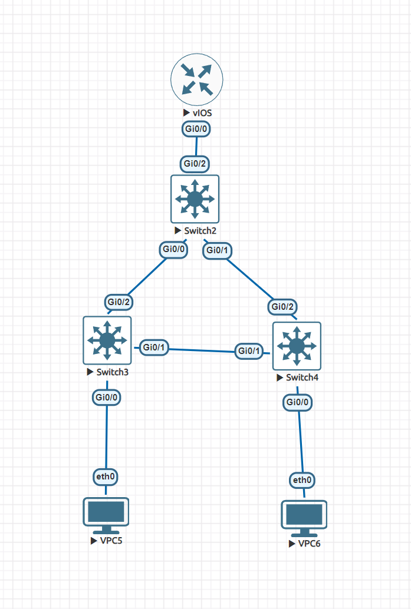
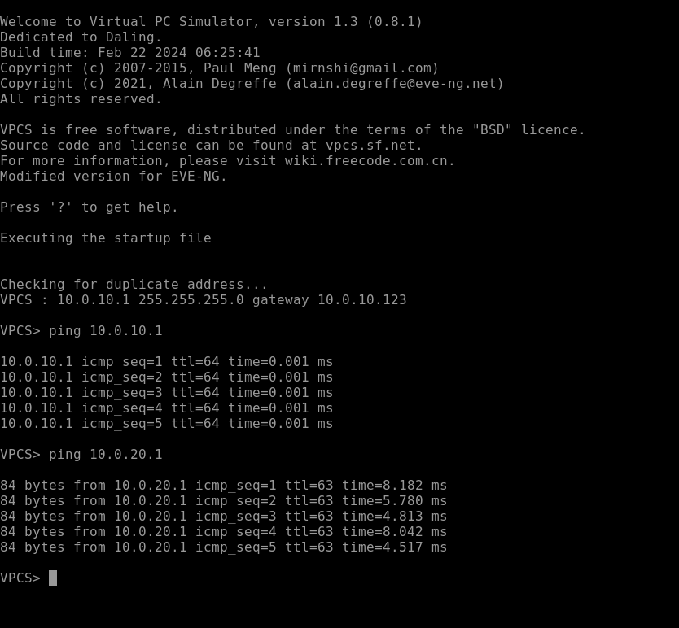
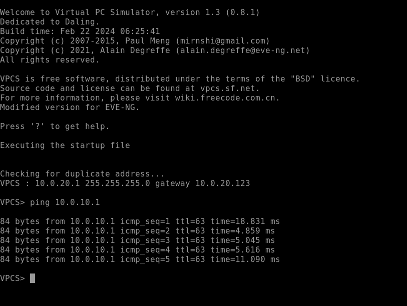
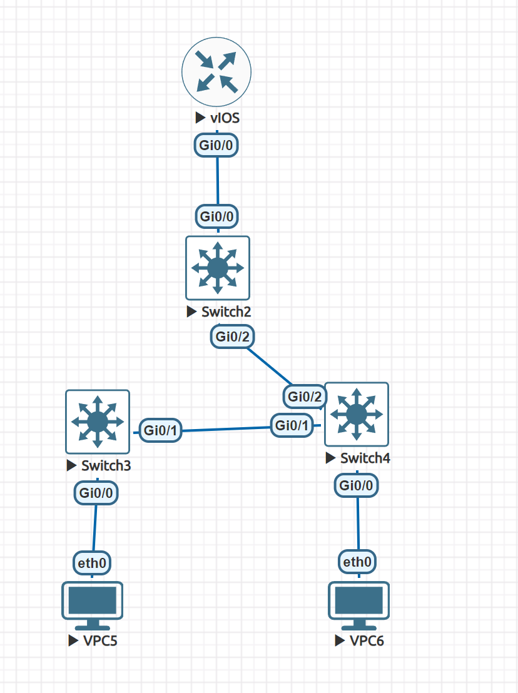

### Общее устройство схемы%

- VPC5 (он же Client1) в VLAN 10 и сети 10.0.10.0/24
- VPC6 (он же Client2) в VLAN 20 и сети 10.0.20.0/24
- STP настроен

### Клиенты пингуют друг друга:

### При отключенном интерфейсе тоже:

В этом случае пинг VPC5 --> VPC6 всё ещё выполняется успешно.

### Выгрузка конфигураций устройств:
https://gist.github.com/shishyando/b87c14695c2e7abff3b91a7746cae16f
